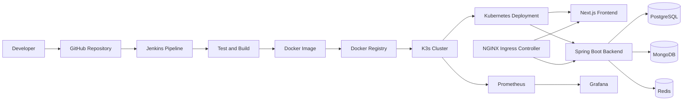

<div align="center">


<a href="https://git.io/typing-svg">
  
</a>

<br/>
<br/>

<a href="https://github.com/DavidNguyen67">
  
</a>

<a href="https://github.com/DavidNguyen67?tab=followers">
  
</a>

<a href="https://github.com/DavidNguyen67">
  
</a>

</div>

---

## `$ whoami`

```typescript
const davidNguyen = {
  fullName: "Nguyen Van Minh Quan",
  username: "DavidNguyen67",
  role: "Full-Stack Developer",
  company: "VNPT",
  location: "Hanoi, Vietnam",

  frontend: [
    "React",
    "Next.js",
    "TypeScript",
    "Tailwind CSS",
  ],

  backend: [
    "Spring Boot",
    "NestJS",
    "Node.js",
    "Java",
    "Kotlin",
  ],

  databases: [
    "PostgreSQL",
    "MySQL",
    "MongoDB",
    "Redis",
  ],

  devops: [
    "Docker",
    "Kubernetes",
    "K3s",
    "Helm",
    "Jenkins",
    "Rancher",
    "NGINX Ingress",
  ],

  observability: [
    "Prometheus",
    "Grafana",
  ],

  currentlyLearning: [
    "Kubernetes Architecture",
    "Cloud-Native Deployment",
    "System Design",
    "Monitoring and Observability",
  ],

  motto: "Build. Deploy. Monitor. Improve.",
};
```

---

## `$ cat about-me.txt`

```text
👨‍💻 Full-Stack Developer working with modern web technologies

⚛️ Building frontend applications with React, Next.js and TypeScript

☕ Developing backend services with Java, Kotlin, Spring Boot and NestJS

🐳 Containerizing applications and services using Docker

☸️ Deploying and managing workloads with Kubernetes and K3s

📦 Managing Kubernetes applications using Helm

🔄 Automating CI/CD pipelines with Jenkins and GitHub Actions

🌐 Configuring traffic with NGINX and Kubernetes Ingress

📊 Monitoring infrastructure with Prometheus and Grafana

🌱 Continuously learning Cloud Native, DevOps and System Design
```

---

## `$ ls ./tech-stack`

### `frontend/`

<p>
  
</p>

<p>
  
  
  
  
  
</p>

### `backend/`

<p>
  
</p>

<p>
  
  
  
  
  
</p>

### `database/`

<p>
  
</p>

<p>
  
  
  
  
</p>

### `devops-and-cloud/`

<p>
  
</p>

<p>
  
  
  
  
  
  
  
  
  
</p>

### `development-tools/`

<p>
  
</p>

---

## `$ cat infrastructure.yaml`

```yaml
developer:
  name: David Nguyen
  role: Full-Stack Developer
  company: VNPT
  location: Hanoi, Vietnam

application:
  frontend:
    framework:
      - Next.js
      - React

    language:
      - TypeScript
      - JavaScript

    styling:
      - Tailwind CSS
      - SCSS

  backend:
    framework:
      - Spring Boot
      - NestJS

    language:
      - Java
      - Kotlin
      - TypeScript

  databases:
    relational:
      - PostgreSQL
      - MySQL

    nosql:
      - MongoDB
      - Redis

deployment:
  containerization:
    - Docker

  orchestration:
    - Kubernetes
    - K3s

  package_management:
    - Helm

  cluster_management:
    - Rancher

  ingress:
    - NGINX Ingress Controller

  ci_cd:
    - Jenkins
    - GitHub Actions

observability:
  metrics:
    - Prometheus

  visualization:
    - Grafana

operating_system:
  - Linux
  - Ubuntu
```

---

## `$ kubectl get skills`

```text
NAME                    CATEGORY          STATUS       LEVEL
nextjs                  frontend          Running      █████████░
react                   frontend          Running      █████████░
typescript              language          Running      █████████░
spring-boot             backend           Running      ████████░░
nestjs                  backend           Running      ████████░░
postgresql              database          Running      ████████░░
redis                   database          Running      ███████░░░
docker                  devops            Running      ████████░░
jenkins                 ci-cd             Running      ███████░░░
kubernetes              orchestration     Learning     ██████░░░░
k3s                     orchestration     Learning     ██████░░░░
helm                    package-manager   Learning     █████░░░░░
rancher                 cluster-manager   Learning     █████░░░░░
prometheus              monitoring        Learning     ████░░░░░░
grafana                 visualization     Learning     ████░░░░░░
```

---

## `$ cat deployment-flow.md`



---

## `$ cat current-infrastructure.txt`

```text
┌──────────────────────────────────────────────────────────────┐
│                        USER REQUEST                          │
└──────────────────────────────┬───────────────────────────────┘
                               │
                               ▼
┌──────────────────────────────────────────────────────────────┐
│                  NGINX / REVERSE PROXY                       │
│              Domain routing and SSL termination              │
└──────────────────────────────┬───────────────────────────────┘
                               │
                               ▼
┌──────────────────────────────────────────────────────────────┐
│                   K3s CLUSTER / KUBERNETES                   │
│                                                              │
│   ┌───────────────────┐       ┌──────────────────────────┐   │
│   │ NGINX Ingress     │──────▶│ Frontend Service         │   │
│   │ Controller        │       │ Next.js                  │   │
│   └─────────┬─────────┘       └──────────────────────────┘   │
│             │                                                │
│             └────────────────▶ Backend Service               │
│                               Spring Boot / NestJS            │
│                                      │                       │
│                                      ▼                       │
│                          PostgreSQL / Redis / MongoDB         │
└──────────────────────────────────────────────────────────────┘
                               │
                               ▼
┌──────────────────────────────────────────────────────────────┐
│                    MONITORING STACK                          │
│                  Prometheus + Grafana                        │
└──────────────────────────────────────────────────────────────┘
```

---

## `$ cat ci-cd-pipeline.yaml`

```yaml
pipeline:
  trigger:
    - GitHub push
    - Manual build

  stages:
    - name: Checkout
      actions:
        - Clone source code
        - Load environment variables

    - name: Install
      actions:
        - Install dependencies
        - Restore package cache

    - name: Test
      actions:
        - Run lint
        - Run unit tests
        - Run type checking

    - name: Build
      actions:
        - Build frontend
        - Build backend
        - Create Docker image

    - name: Push
      actions:
        - Authenticate with Docker registry
        - Push versioned Docker image

    - name: Deploy
      actions:
        - Update Kubernetes Deployment
        - Wait for rollout
        - Verify readiness probes

    - name: Monitor
      actions:
        - Collect metrics with Prometheus
        - Visualize metrics with Grafana

  platform:
    ci_cd: Jenkins
    container: Docker
    orchestrator: K3s
    package_manager: Helm
```

---

## `$ cat learning-roadmap.md`

```text
Cloud Native Roadmap
│
├── Kubernetes Fundamentals
│   ├── Pod
│   ├── Deployment
│   ├── ReplicaSet
│   ├── Service
│   ├── ConfigMap
│   └── Secret
│
├── Networking
│   ├── ClusterIP
│   ├── NodePort
│   ├── Ingress
│   ├── DNS
│   └── NGINX Ingress Controller
│
├── K3s
│   ├── Single-node cluster
│   ├── Multi-node cluster
│   ├── Agent and server
│   └── Production deployment
│
├── Helm
│   ├── Charts
│   ├── Values
│   ├── Releases
│   └── Upgrade and rollback
│
├── CI/CD
│   ├── Jenkins Pipeline
│   ├── Docker build
│   ├── Image registry
│   └── Kubernetes rollout
│
└── Observability
    ├── Prometheus
    ├── Grafana
    ├── Application metrics
    └── Infrastructure monitoring
```

---

## `$ git status`

```text
On branch main

Current focus:

  modified:   Full-Stack Development
  modified:   Kubernetes and K3s
  modified:   Jenkins CI/CD
  modified:   Docker Deployment
  modified:   Cloud-Native Architecture
  modified:   Monitoring and Observability

Nothing to commit, always building.
```

---

## `$ echo $CURRENT_FOCUS`

```text
[01] Building scalable full-stack applications

[02] Developing frontend systems using Next.js and TypeScript

[03] Creating backend services with Spring Boot and NestJS

[04] Containerizing applications using Docker

[05] Deploying applications to a self-managed K3s cluster

[06] Managing Kubernetes workloads with Helm and Rancher

[07] Automating CI/CD pipelines using Jenkins

[08] Configuring NGINX Ingress for domain-based routing

[09] Monitoring infrastructure with Prometheus and Grafana

[10] Improving system design and cloud-native knowledge
```

---

## `$ git stats`

<div align="center">


</div>

<br/>

<div align="center">


</div>

---

## `$ git log --graph`

<div align="center">


</div>

---

## `$ cat github-trophies.txt`

<div align="center">


</div>

---

## `$ cat featured-projects.md`

### Clinic Management System

```yaml
type: Full-Stack Application

frontend:
  - Next.js
  - React
  - TypeScript

backend:
  - Spring Boot
  - PostgreSQL
  - Redis

deployment:
  - Docker
  - Kubernetes
  - K3s
  - Jenkins
  - NGINX Ingress

monitoring:
  - Prometheus
  - Grafana
```

### Accounting System

```yaml
type: Full-Stack Application

frontend:
  - Next.js
  - TypeScript
  - Ant Design

backend:
  - NestJS
  - TypeORM
  - JWT

database:
  - PostgreSQL
  - MongoDB
  - Redis

deployment:
  - Docker
  - Jenkins
```

---

## `$ cat principles.txt`

```text
01. Write code that humans can understand.

02. Automate repetitive tasks.

03. Keep systems simple before making them scalable.

04. Monitor applications after deployment.

05. Fix the root cause, not only the symptom.

06. Learn by building real systems.

07. Build. Deploy. Monitor. Improve.
```

---

## `$ ping DavidNguyen67`

<div align="center">

<a href="https://github.com/DavidNguyen67">
  
</a>

<a href="mailto:davidnguyen67dev@gmail.com">
  
</a>

</div>

---

<div align="center">

### `Connection established successfully.`

```text
$ systemctl status david-nguyen

● david-nguyen.service
   Loaded: loaded
   Active: active (running)
   Status: "Building, deploying and learning..."
```

**“First, solve the problem. Then, write the code.”**

<br/>


</div>
